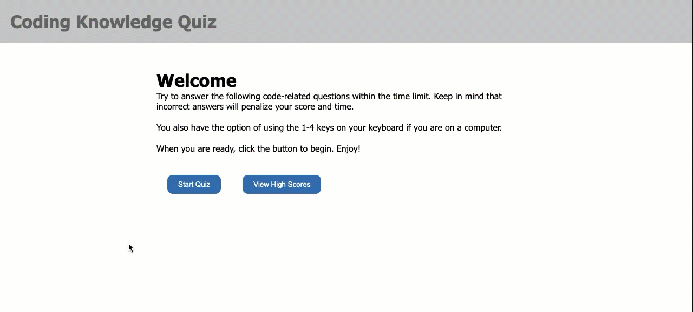
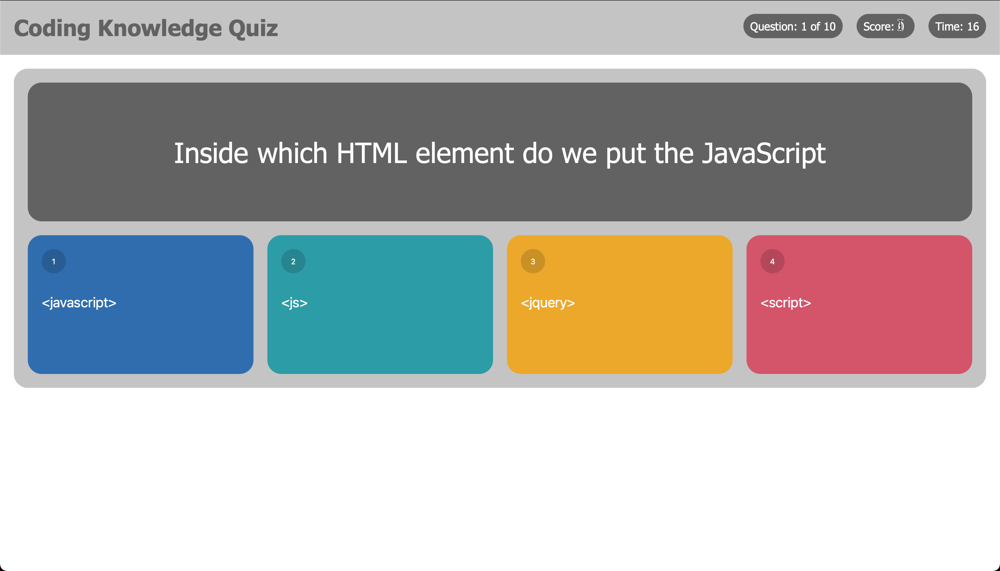
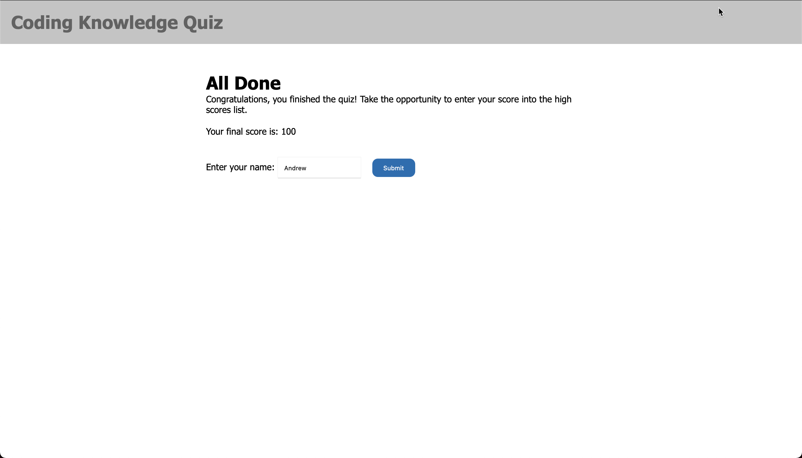
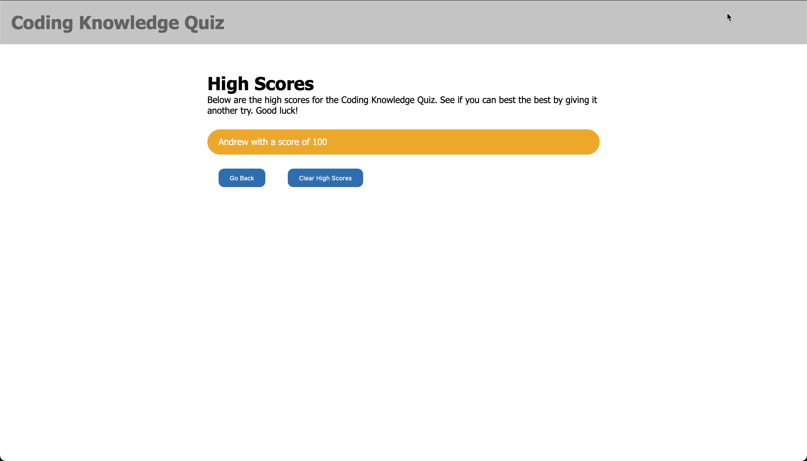

# code-challenge

## Description
At some point as a full-stack web developer, you’ll likely be asked to complete a coding assessment. A typical coding assessment includes both multiple-choice questions and interactive coding challenges. To help familiarize you with these tests with a timed coding quiz with multiple-choice questions.

## Usage
You can access the app here: [https://avidrunner87.github.io/code-challenge/](https://avidrunner87.github.io/code-challenge/).

## User Story
**AS AN** coding boot camp student 
I **WANT** to take a timed quiz on JavaScript fundamentals that stores high scores 
**SO THAT** I can gauge my progress compared to my peers

### Acceptance Criteria
**GIVEN** I am taking a code quiz

>WHEN I click the start button 
THEN a timer starts and I am presented with a question

>WHEN I answer a question 
THEN I am presented with another question

>WHEN I answer a question incorrectly 
THEN time is subtracted from the clock

>WHEN all questions are answered or the timer reaches 0 
THEN the game is over

>WHEN the game is over 
THEN I can save my initials and my score

## Licenses

## Technologies

## Mock-up
The following picture shows the website appearance and capabilities:

 

 

## Installation
To fork this code to further improve the website, please follow these directions:

1. In Github fork the repository.
1. Clone the repository to your local computer.

_This assumes that you have setup your own SSH keys to connect with Github._

## References
[MDN Web Docs](https://developer.mozilla.org/en-US/docs/Web/HTML/Element) 
[W3 Schools](https://www.w3schools.com/) 
